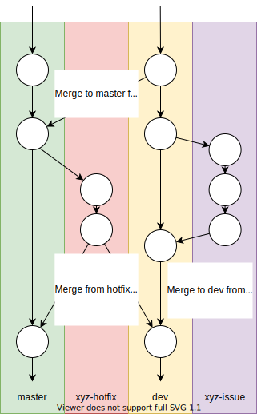

# Contribute
This section aims to explain how we develop and organise,
in order to help those that want to contribute to SimPhoNy.

## Background
### Tools
The following are some of the technologies and concepts we use regularly.
It might be useful to become familiar with them:
 - Version control: Git, GitHub and GitLab
 - Python virtual environments/conda
 - Docker
 - Unittesting
 - Benchmarks
 - Continuous integration

### Code Organisation
There are 3 main categories of repos:
 - [_OSP-core_](https://github.com/simphony/osp-core) contains the nucleus of SimPhoNy, the base on which the wrappers build.
 - Each _wrapper_ will be in its own repository on GitHub or GitLab,
   mimicking [wrapper_development](https://github.com/simphony/wrapper-development).
 - [_docs_](https://github.com/simphony/docs) holds the source for this documentation.

There are also 4 types of branches:
 - `master/main` contains all the releases, and should always be stable.
 - `dev` holds the code for the newest release that is being developed.
 - `issue branch` is where an specific issue is being solved.
 - `hotfix branch` is where a critical software bug detected on the stable release (more on this later) is being solved.

All wrappers and OSP-core are part of a common directory structure:
- _`osp/`_: contains all the SimPhoNy source code.
  - _`core/`_: OSP-core source code.
  - _`wrappers/`_: wrappers source code.
    - _`wrapper_xyz/`_: one folder per wrapper implementation.
- _`tests/`_: unittests of the code.
- _`examples/`_: simple examples of how to use a certain feature.

## Developing workflow
- Every new feature or bug is defined in an issue and labelled accordingly.  
 If there is something that is missing or needs improving,
 make an issue in the appropriate project.
- Generally, the issues are fixed by creating a new `issue branch` from the `dev` branch, committing to that branch and making a new Pull/Merge Request when done. 
  An owner of the project should be tagged for review.
  They will review and merge the PR if the fix is correct, deleting the `issue branch` afterwards.
  The changes should be clearly explained in the issue/Pull Request.
  
```eval_rst
.. warning::
   If the issue is a critical software bug detected in the stable release, a 
   `hotfix branch` should be created from the `master/main` branch instead. 
   
   After committing to such branch, a new Pull/Merge request (targeting `dev`) 
   should be created. If the fix is correct, the project owner will merge the 
   PR to `dev`, additionally merge the `hotfix branch` to `master/main`, and 
   then delete the `hotfix branch`.
```

- Once the features for a release have been reached, `dev` will be merged to 
  `master/main`. Every new commit in the `master/main` branch generally corresponds 
  a new release. An exception to this rule may apply, for example when several 
  critical hotfixes are applied in a row, as it would then be better to just to 
  publish a single release afterwards.

In the next image it can be seen how the branches usually look during this 
workflow, and the different commits used to synchronise them:

<figure style="display: table; text-align:center; margin-left: auto; margin-right:auto">



</figure>

## Coding
### Documenting
- All code must be  properly documented with meaningful comments.
- For readability, we now follow the [Google docstring format](https://google.github.io/styleguide/pyguide.html#s3.8-comments-and-docstrings).
- If some behaviour is very complex, in-line comments can be used. 
  However, proper naming and clear operations are always preferred.

### Testing
- All Python code should pass Flake8 tests.
- All complex functionality must be tested.
- If some implementation can not be checked through unittest, it should be at least manually run in different systems to assure an expected behaviour.

### Continuous Integration
- We currently run the CI through Github Actions/GitLab CI.
- Flake8 and unittests are automatically run for all PR. 
- For the OSP-core code, benchmarks are run after every merge to `dev`. Benchmark results are 
  available [here](https://simphony.github.io/osp-core/dev/bench/index.html). 
  The CI will report a failure when a benchmark is 50% slower than in the previous run, in addition to automatically commenting on the commit. 

### Naming conventions
- Use `cuds_object` as the argument name of your methods (not `entity`, `cuds`, `cuds_instance`...).
- The official spelling is `OSP-core` (as opposed to _osp core_, _OSP-Core_ or similar).

## Contribute to OSP-core
If you are not a member of the [SimPhoNy organisation](https://github.com/simphony), rather than creating a branch
from `dev`, you will have to fork the repository and create the Pull Request.

## Contribute to wrapper development
For a sample wrapper, visit the [wrapper_development](https://github.com/simphony/wrapper-development) repo.

README files should include:
- Information regarding the purpose of the wrapper and the backend used.
- A compatibility matrix with OSP-core.
- Installation instructions.
- Folder structure.
- Any other necessary information for users and other developers.

## Contribute to the docs
If you have any suggestion for this documentation, whether it is something that needs more explanation, is inaccurate or simply a note on anything that could be improved, you can open an issue [here](https://github.com/simphony/docs/issues), and we will look into it!.


