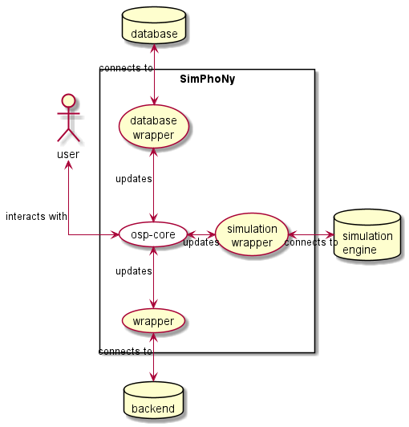
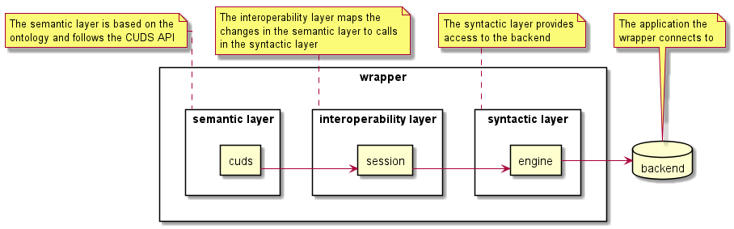
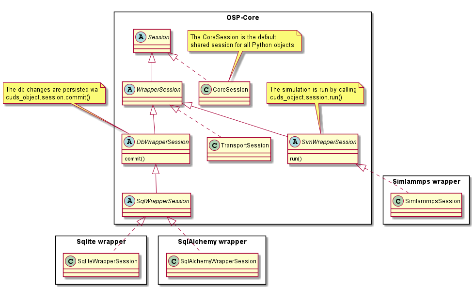

# Getting started

## About
SimPhoNy is an ontology-based framework that promotes and enables interoperability between any 3rd-party software tool. It’s latest version is soon to become an open-source python project. The name ‘SimPhoNy’ stems from the SimPhoNy EU-project in which it was originally developed (See more details [here](https://www.simphony-project.eu/)). 
One of SimPhoNy’s main tasks is to convert *opaque* data, meaning data whose semantics are hidden, to *transparent* data, that is data whose semantics is understood and easily accessible.

This project aims to clarify the purpose and usage of the SimPhoNy platform through simple, short examples.
In particular, this guide will try to expose the main concepts and components.

_Contact:_ [Pablo de Andres](mailto:pablo.de.andres@iwm.fraunhofer.de), 
[Matthias Urban](mailto:matthias.urban@iwm.fraunhofer.de) and 
[Yoav Nahshon](mailto:yoav.nahshon@iwm.fraunhofer.de) from 
the Materials Data Science and Informatics team, Fraunhofer IWM.

_Version:_ 2.0 pending approval

## Terminology
These are some of the terms used in the following sections:
1. `ontology`: an explicit, formal specification of a shared conceptualization.
1. `API`: Application Programming Interface. A set of functions that allow the interaction with an application or system.
1. `OSP`: Open Simulation Platform. 
   A set of common standards and related tools that form the basic environment on top of which compatible and compliant simulation workflows can be developed and run.
   An OSP does not contain any simulation tools itself, it is the common framework enabling to couple and link them.
1. `backend`: a third party application or service. 
   Simulation engines and databases are examples of backends.
1. `wrapper`: a plugin for OSP-core that adds support to a new backend.
   It must allow the user to interact with the backend through the same API as OSP-core.
1. `CUDS`:  Common Universal Data Structure. A data structure that is used to uniformly represent ontology concepts in programming code.
    - CUDS exposes an API that provides CRUD (Create, Read, Update and Delete) functionalities.
    - CUDS is a recursive data structure in that a CUDS object may contain other CUDS objects.
1. `CUDS class`: represents an ontology class (a concept) and encodes its ontological information.
1. `CUDS object`: is an instance of a CUDS class and represents an ontology individual.

CUDS is the fundamental data type of OSP-core, a framework that establishes interoperability between software systems that are built on top of ontologies.

## General design
The purpose of this framework is to provide an easy, standard interoperability between multiple different backends through the exchange of data stored in an ontology-based data-structure.

```eval_rst

.. uml::

  @startuml
    skinparam linetype ortho
    actor user
    rectangle SimPhoNy {
      usecase "osp-core" as osp #FFFFFF
      usecase "database\nwrapper" as db_wrapper
      usecase "simulation\nwrapper" as sim_wrapper
      usecase wrapper
    }
    database database
    database "simulation\nengine" as sim_engine
    database backend

  ' -----------------------
  ' ------ RELATIONS ------
  ' -----------------------
    user -[hidden]right- SimPhoNy
    SimPhoNy -[hidden]right- sim_engine
    user <-right-> osp: interacts with

    db_wrapper <-up-> database: connects to
    sim_wrapper <-right-> sim_engine: connects to
    wrapper <-down-> backend: connects to

    osp <-up-> db_wrapper: updates
    osp <-right-> sim_wrapper: updates
    osp <-down-> wrapper: updates
    @enduml    
```
<details>
  <summary>Alternative image</summary>

  

</details>

As you can see, osp-core provides the standard data format, and the wrappers take care of mapping that format to the backend specific syntax.

For that, a 3 layer schema is used:

```eval_rst
.. uml::

  @startuml
    skinparam linetype ortho
    rectangle wrapper {
      rectangle "semantic layer" as sem {   
        rectangle cuds
      }
      rectangle "interoperability layer" as intop {   
        rectangle session
      }
      rectangle "syntactic layer" as syn {   
        rectangle engine
      }
    }
    database backend
      

  ' -----------------------
  ' ------ RELATIONS ------
  ' -----------------------
    engine -> backend
    cuds -> session
    session -> engine

  ' -----------------------
  ' -------- NOTES --------
  ' -----------------------
    note as note_sem
      The semantic layer is based on the
      ontology and follows the CUDS API
    end note
    note_sem .. sem

    note as note_intop
      The interoperability layer maps the
      changes in the semantic layer to calls
      in the syntactic layer
    end note
    note_intop .. intop

    note as note_syn
      The syntactic layer provides
      access to the backend
    end note
    note_syn .. syn

    note as note_backend
      The application the
      wrapper connects to
    end note
    note_backend .. backend
  @enduml
```

<details>
  <summary>Alternative image</summary>

  

</details>

The *Semantic layer* are the classes generated from the ontology.

The *Interoperability layer*, specifically the session class, is generally the main development when creating a new wrapper.
It must go through the changes done by the user in the semantic layer and do the appropriate modifications in the backend (through the use of the syntactic layer).
It must also be able to update the semantic layer with the changes that might have happened in the backend.

The *Syntactic layer* is in direct communication with the backend. It has no ontological knowledge and must just provide a simple interface for the interoperability layer to interact with the wrapped application. This means it may have to be a binding if the application is in a different language. In other cases, (e.g. LAMMPS with PyLammps) it is provided by the backend itself, and requires no implementation.

## OSP-core
OSP-core is the main component of the SimPhoNy framework.
It is independent of any backend and provides the basic ontology based data structures for the seamless exchange of data between wrappers.


### Ontology
OSP-core requires an ontology file to create the appropriate CUDS classes.

Said ontology must be in a YAML format as defined by [our specification](yaml_spec.md).

<details>
  <summary>Ontology sample</summary>

  ```yaml
    version: "0.0.1"
    namespace: "CUBA"

    ontology:
      ENTITY:
        description: The root of the ontology.
        subclass_of: []

      NOTHING:
        description: A class without any individuals.
        subclass_of:
        - CUBA.ENTITY

    ################

      RELATIONSHIP:
        description: The root of all relationships.
        subclass_of:
        - CUBA.ENTITY

      ACTIVE_RELATIONSHIP:
        description: The root of all active relationships. Active relationships express that one cuds object is in the container of another.
        subclass_of:
        - CUBA.RELATIONSHIP

      ################

      WRAPPER:
        description: The root of all wrappers. These are the bridge to simulation engines and databases.
        subclass_of:
        - CUBA.ENTITY

      ATTRIBUTE:
        description: The root of all attributes.
        subclass_of:
        - CUBA.ENTITY
  ```
</details>

OSP-core can also be used with EMMO (European Materials and Modelling Ontology).
Tools for converting EMMO from the OWL format to YAML are provided. See more [here](working_with_emmo.md).

### Python classes
Upon installation of OSP-core, each ontology class (except from attributes and relationships) becomes a python class.

Since each ontology has a namespace, it can be used to import the classes and create cuds objects:

```py
from osp.core import cuba, another_namespace

entity = cuba.Entity()
other_entity = another_namespace.SomeOtherEntity()
```

### Sessions
The sessions are the interoperability classes that connect to where the data is stored. In the case of wrappers, they take care of keeping consistency between the backends (e.g. databases) and the internal registry.

To simplify the understanding and development of session classes, we have created a hierarchy:

```eval_rst
.. uml::

  @startuml

  rectangle "OSP-Core" as OSP {
    abstract class Session {
    }

    class CoreSession implements Session {
    }

    abstract class WrapperSession extends Session {
    }

    class TransportSession implements WrapperSession {
    }

    abstract class DbWrapperSession extends WrapperSession {
      commit()
    }

    abstract class SqlWrapperSession extends DbWrapperSession {
    }

    abstract class SimWrapperSession extends WrapperSession {
      run()
    }
  }

  rectangle "Sqlite wrapper" as sqlite {
    class SqliteWrapperSession implements SqlWrapperSession {
    }
  }

  rectangle "SqlAlchemy wrapper" as sqlalchemy {
    class SqlAlchemyWrapperSession implements SqlWrapperSession {
    }
  }

  rectangle "Simlammps wrapper" as simlammps {
    class SimlammpsSession implements SimWrapperSession {
    }
  }

  ' -----------------------
  ' -------- NOTES --------
  ' -----------------------
    note as OSP.note_core
      The CoreSession is the default
      shared session for all Python objects
    end note
    OSP.note_core .. CoreSession

    note as note_db
      The db changes are persisted via
      cuds_object.session.commit()
    end note
    note_db .. DbWrapperSession

    note as OSP.note_sim
      The simulation is run by calling
      cuds_object.session.run()
    end note
    OSP.note_sim .. SimWrapperSession
  @enduml
```
<details>
  <summary>Alternative image</summary>

  

</details>

As you can see, CoreSession is the default one used when instantiating a new object in your workspace.

When you add an object to a wrapper, a copy of the object is created in the registry belonging to the session of the wrapper.

## Wrappers
Like we have mentioned in previous sections, wrappers allow the user to interact 
through the cuds API with different backends.

Since each backend is different, for more detailed documentation of each wrapper
we suggest going through the different available [repositories]
(https://gitlab.cc-asp.fraunhofer.de/simphony/wrappers/).

For more technical information regarding wrappers, particularly for wrapper developers, 
we recommend visiting [wrapper development](https://gitlab.cc-asp.fraunhofer.de/simphony/wrappers/wrapper-development/).

## Installation
For the installation and usage of the framework, we *highly* encourage the use of a [virtual environment](https://docs.python.org/3/tutorial/venv.html):

```shell
~/test$ python3 -m venv SimPhoNy
~/test$ source SimPhoNy/bin/activate
(SimPhoNy) ~/test$ 
```

### OSP-core installation
First, the repository must be cloned:

```shell
git clone git@gitlab.cc-asp.fraunhofer.de:simphony/osp-core.git
```

Once available locally, the project must be installed. The default installation is:

```shell
cd osp-core
python3 setup.py install
```

After installing osp-core, you can install an ontology file using **pico** (**p**ico **i**nstalls **c**uds **o**ntologies):

```shell
pico install <path/to/ontology.yml>
```

### Wrapper installation
The installation of a wrapper is similar. First, the repository is cloned:

```shell
git clone git@gitlab.cc-asp.fraunhofer.de:simphony/wrappers/<some-wrapper>.git
```

If the wrapper has its own ontology, this ontology *must* be installed:

```shell
pico install <path/to/ontology.yml>
```

For the wrappers that require the installation of a backend, a `install_engine.sh` script is provided.
It will automatically call `install_engine_requirements.sh`, where the engine specific requirements are installed.

```shell
./install_engine.sh
```

Now the wrapper can be installed:

```shell
python3 setup.py install
```

Some wrappers also provided a [Dockerfile](https://docs.docker.com/engine/reference/builder/) for an automatic installation in a container.
