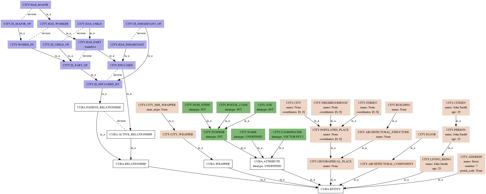

# Introduction on ontologies

**What is an ontology?**

An ontology defines a set of representational primitives with which to
model a domain of knowledge or discourse. The representational
primitives are typically classes (or sets), attributes (or properties),
and relationships (or relations among class members). The definitions of
the representational primitives include information about their meaning
and constraints on their logically consistent application. (Source:
<http://tomgruber.org/writing/ontology-definition-2007.htm>)

[//]: # (TODO Extend)

## An example: the City ontology

OSP-core ships with one simple example ontology, called `city`. 
You can use it to play around and get familiar with OSP-core.
We will also use it a lot in this documentation as an example.

The city ontology provides the concepts to describe people and
buildings in a city. In this graph we show the different entities in the
ontology. We used [Ontology2Dot](utils.md#ontology2dot) for that:



To use the city ontology you have to install it using the tool [Pico](utils.md#pico-installs-cuds-ontologies):

```sh
pico install city
```

Take a look at our [examples](jupyter/cuds_api.md) to see how you can build your own city!
