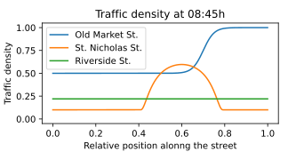

# Overview

SimPhoNy is an ontology-based framework aimed at enabling interoperability between different simulation and data management tools, with a focus on materials science.

## What can SimPhoNy be used for?

### Manipulate ontology-based linked data, a format well suited for [FAIR data principles](https://en.wikipedia.org/wiki/FAIR_data)

[Linked data](https://en.wikipedia.org/wiki/Linked_data) is a format for structured data that facilitates the interoperability among different data sources. In particular, the data is structured as a directed graph, consistent of nodes and labeled arcs. With SimPhoNy, you can not only manipulate this linked data, **but also transform existing non-linked data into linked data**.

To better understand the idea of linked data, take a quick glance at the toy example below. It shows data about a city from three different data sources: the city's traffic authority, a map from a city guide, and the university registry. As some of the concepts are present in multiple datasets, the linked data representation naturally joins all of them into a single one.

<figure style="display: table; text-align:center; margin-left: auto; margin-right:auto">

<figcaption style="display: table-caption; caption-side: bottom; text-align:center">

_Linked data about a city from three different sources: the city's traffic authority, a map from a city guide, and the university registry. Each data source is represented using a different color and column._

</figcaption>

</figure>

Although the example above shows just plain linked data, in SimPhoNy, the linked data is enhanced with [ontologies](<https://en.wikipedia.org/wiki/Ontology_(information_science)>), which give **meaning** to the data. Specifically, SimPhoNy works with ontologies based on the [Web Ontology Language](https://en.wikipedia.org/wiki/Web_Ontology_Language), making the data compatible with the [Semantic Web](https://en.wikipedia.org/wiki/Semantic_Web).

### Fetch data from a database, run a simulation and immediately store the results

Ontology-based linked data is not only well suited for the interoperability of data, but also of software tools. In SimPhoNy, one can instantiate individuals from special ontology classes called _wrappers_. These wrappers are in fact a software interface between the core of SimPhoNy (ontology based) and external software tools, disguised to the user as an ontology class. We have already developed wrappers for a few database backends and popular simulation engines for materials science. You can have a look at the existing wrappers on our [GitHub organization](https://github.com/simphony). If needed, you may even consider [developing your own](./wrapper_development.md)!

As a SimPhoNy user, you can see the data stored in the external software tools transparently as ontology individuals through the wrappers. In this way, moving data between different software tools becomes as simple as moving or copying it from one wrapper to another.

For example, linked data stored in a SQLite database can be used to run a simulation just by adding the ontology individuals contained in the SQLite wrapper to the Simulation Engine wrapper. Similarly, the ontology individuals representing the results can be simply added back into the database wrapper.

<figure style="display: table; text-align:center; margin-left: auto; margin-right:auto">

<figcaption style="display: table-caption; caption-side: bottom; text-align:center"></figcaption>

</figure>

At this point, the results could be fetched again and for example, visualized with the help of a plotting library.

<figure style="display: table; text-align:center; margin-left: auto; margin-right:auto">

<figcaption style="display: table-caption; caption-side: bottom; text-align:center"></figcaption>

</figure>

### Couple simulation engines easily

Exactly in the same way that the data can be moved between a database and a simulation engine using their respective wrappers, it can also be moved between simulation engines.

This functionality facilitates the coupling and linking between such simulation engines. For example, in the domain of materials science, a certain engine might be useful for representing structures made up of atomistic particles (molecular dynamics), while another software tool could be focussed on representing bodies of fluids (fluid dynamics). As SimPhoNy can enable communication between the two tools, they could both be run and synced simultaneously to create more complex scenarios, such as a multi-scale simulation.

<figure style="display: table; text-align:center; margin-left: auto; margin-right:auto">

<iframe src="./_static/videos/coupling_and_linking.mp4" frameborder="0" allowfullscreen="true"></iframe>

<figcaption style="display: table-caption; caption-side: bottom; text-align:center">

The concepts of coupling and linking illustrated in a video.

</figcaption>

</figure>

In order achieve that, it would be necessary to translate the input and output formats of both simulation engines. However, given that the necessary wrappers exist, and their ontologies are compatible, this task becomes relatively simple thanks to SimPhoNy! At the end of the coupling process, just add the results to a database wrapper to store them.

<figure style="display: table; text-align:center; margin-left: auto; margin-right:auto">

<figcaption style="display: table-caption; caption-side: bottom; text-align:center">

_Coupling of two simulation engines, one that handles fluid dynamics
(macroscopic behavior) and another that takes care of molecular dynamics
(microscopic behavior)._

</figcaption>

</figure>

# Terminology

The name ‘SimPhoNy’ stems from the SimPhoNy EU-project in which it was originally developed (see more details [here](https://www.simphony-project.eu/)).

Here are some additional terms that are used throughout the documentation:

1. `backend`: a third party application or service.
   Simulation engines and databases are examples of backends.
1. `wrapper`: a plugin for OSP-core that adds support to a new backend.
   It must allow the user to interact with the backend through the same API as OSP-core.
1. `ontology`: an explicit, formal specification of a shared conceptualization.
   In the context of ontology, other relevant terms are:
   1. `class`: a concept. E.g., 'City', 'Experiment'.
   1. `attribute`: a property of a class that has a data type. E.g., 'name' of the type String which could be used as an attribute of 'City'.
   1. `individual`: an instance of a class. E.g., an instance of the class 'City' can be used to represent the city of Freiburg in which case it would have the attribute 'name' with the value 'Freiburg'.
   1. `relationship`: a type of a way in which one individual relates to another. E.g., 'Has-A' which could use to form the relationship 'Freiburg (City) Has-A Dreisam (River)'.
   1. `entity`: a general term that can refer to a class, a relationship, attribute, or an individual. E.g., 'City', 'name', 'Has-A', the Freiburg individual are all entities.
   1. `namespace`: an ontology identifier. E.g., 'city_ontology' which could be used as a namespace for the ontology that consists of the entities 'City', 'name' and 'Has-A'.
      - Each entity is uniquely identified by its name and the namespace it is contained in. We call \<namespace name\>.\<entity name\> the `qualified entity name`.
1. `CUDS`: Common Universal Data Structure. A data structure that is used to uniformly represent ontology concepts in programming code.
   - CUDS exposes an API that provides CRUD (Create, Read, Update and Delete) functionalities.
   - CUDS is a recursive data structure in that a CUDS object may contain other CUDS objects.
   - CUDS is the fundamental data type of OSP-core, a framework that establishes interoperability between software systems that are built on top of ontologies.
