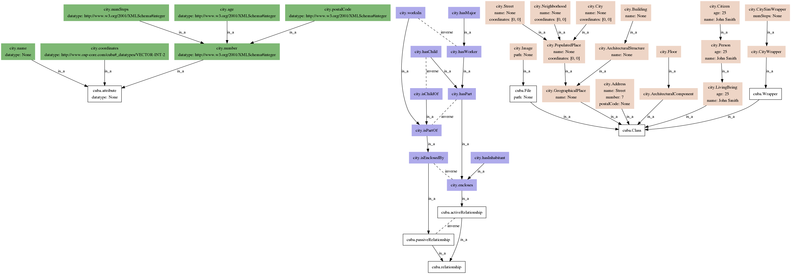

# Included ontologies

To use an ontology, you first have to add it to SimPhoNy by
[installing](pico.md#pico-install) an [ontology package](packages.md).
Ontology packages are
[YAML configuration files](https://en.wikipedia.org/wiki/YAML) that, in
addition to pointing to the actual ontology file, also define extra metadata.

We bundle a few of these files with SimPhoNy to enable rapid installation of
common, well-known ontologies. The included ontologies, together with their
domains of application, are listed below.

- [](#elementary-multiperspective-material-ontology-emmo)
  \- Applied sciences

- [](#dublin-core-metadata-initiative-dcmi)
  \- Metadata description

- [](#data-catalog-vocabulary-dcat)
  \- Data catalogue information

- [](#friend-of-a-friend-foaf)
  \- People and information on the web

- [](#the-prov-ontology-prov-o)
  \- Provenance information

- [](#the-city-ontology)
  \- Example ontology aimed at demonstrating the usage of SimPhoNy

The ontologies can be installed providing the right
_[package identifier](packages.md#keywords)_ to
[_pico_](pico.md), the SimPhoNy's ontology management tool. You can
find such package identifier and additional information on each ontology by
clicking on the links from the list above.

Do not hesitate to
[contact us](../../contact.md) if you want your ontology to be shipped with
SimPhoNy.

## Elementary Multiperspective Material Ontology (EMMO)

```{eval-rst}
.. epigraph::

   EMMO is a multidisciplinary effort to develop a standard representational
   framework (the ontology) for applied sciences. It is based on physics,
   analytical philosophy and information and communication technologies. It
   has been instigated by materials science to provide a framework for
   knowledge capture that is consistent with scientific principles and
   methodologies. It is released under a Creative Commons
   `CC BY 4.0 <https://github.com/emmo-repo/EMMO/blob/master/LICENSE.md>`_
   license.

   -- `About EMMO section <https://github.com/emmo-repo/EMMO#about-emmo>`_,
   from the
   `official EMMO GitHub repository <https://github.com/emmo-repo/EMMO#readme>`_
```

To install the [EMMO ontology](https://emmo-repo.github.io/), use

```sh
pico install emmo
```

A few _EMMO domain ontologies_ are also included, and
may be installed passing the adequate package identifier to `pico install`.

- [Datamodel ontology](https://github.com/emmo-repo/datamodel-ontology)
  (version 0.0.2) - `emmo-datamodel`

## Dublin Core Metadata Initiative (DCMI)

```{eval-rst}
.. epigraph::

   The Dublin Core™ Metadata Initiative, or "DCMI", is an organization
   supporting innovation in metadata design and best practices across the
   metadata ecology. DCMI works openly, and it supported by a
   `paid-membership model <https://www.dublincore.org/membership/>`_.

   -- `About DCMI <https://www.dublincore.org/about/>`_
```

The Dublin Core™ Metadata Initiative has published, among others, the
[DCMI Metadata Terms](https://www.dublincore.org/specifications/dublin-core/dcmi-terms/)
specification, which establishes a set of core metadata terms enabling
cross-domain description of resources on the web.

```{eval-rst}
.. epigraph::

   Included are the fifteen terms of the Dublin Core™ Metadata Element Set
   (also known as "the Dublin Core") plus several dozen properties, classes,
   datatypes, and vocabulary encoding schemes. [...] These terms are intended
   to be used in combination with metadata terms from other, compatible
   vocabularies in the context of application profiles.

   -- `DCMI Metadata Terms <https://www.dublincore.org/specifications/dublin-core/dcmi-terms/>`_
```

To install the `dcmitype`, `dcelements`, `dcam` and `dcterms` RDFS vocabularies
from the
[Dublin Core Metadata Initiative (DCMI)](https://www.dublincore.org/specifications/dublin-core/dcmi-terms/),
use

```sh
pico install dcmitype dcelements dcam dcterms
```

## Data Catalog Vocabulary (DCAT)

```{eval-rst}
.. epigraph::

   DCAT is an RDF vocabulary designed to facilitate interoperability
   between data
   catalogs published on the Web. [...]

   DCAT enables a publisher to describe datasets and data services in a catalog
   using a standard model and vocabulary that facilitates the consumption and
   aggregation of metadata from multiple catalogs. This can increase the
   discoverability of datasets and data services. It also makes it possible to
   have a decentralized approach to publishing data catalogs and makes
   federated search for datasets across catalogs in multiple sites possible
   using the same query mechanism and structure. Aggregated DCAT metadata
   can serve as a manifest file as part of the digital preservation process.

   -- `Data Catalog Vocabulary (DCAT) - Version 2 <https://www.w3.org/TR/vocab-dcat-2/>`_
```

To install the [DCAT ontology](https://www.w3.org/TR/vocab-dcat-2/)
(version 2), use

```sh
pico install dcat
```

## Friend of a Friend (FOAF)

```{eval-rst}
.. epigraph::

   FOAF is a project devoted to linking people and information using the Web.
   Regardless of whether information is in people's heads, in physical or
   digital documents, or in the form of factual data, it can be linked.
   FOAF integrates three kinds of network: social networks of human
   collaboration, friendship and association; representational networks that
   describe a simplified view of a cartoon universe in factual terms, and
   information networks that use Web-based linking to share independently
   published descriptions of this inter-connected world. FOAF does not
   compete with socially-oriented Web sites; rather it provides an approach
   in which different sites can tell different parts of the larger story,
   and by which users can retain some control over their information in a
   non-proprietary format.

   -- `FOAF Vocabulary Specification <http://xmlns.com/foaf/spec/>`_
```

To install the [FOAF ontology](http://xmlns.com/foaf/spec/), use

```sh
pico install foaf
```

## The PROV Ontology (PROV-O)

```{eval-rst}
.. epigraph::

   The PROV Ontology (PROV-O) expresses the PROV Data Model
   [`PROV-DM <https://www.w3.org/TR/prov-o/#bib-PROV-DM>`_]
   using the OWL2 Web Ontology Language (OWL2)
   [`OWL2-OVERVIEW <https://www.w3.org/TR/prov-o/#bib-OWL2-OVERVIEW>`_].
   It provides a set of classes, properties, and restrictions that can be used
   to represent and interchange provenance information generated in different
   systems and under different contexts. It can also be specialized to create
   new classes and properties to model provenance information for different
   applications and domains.

   -- `PROV-O: The PROV Ontology <https://www.w3.org/TR/prov-o/>`_
```

To install the [PROV-O ontology](https://www.w3.org/TR/prov-o/), use

```sh
pico install prov
```

## The City ontology

The City ontology is a simple, example ontology included with SimPhoNy. It
provides a collection of concepts to describe people and buildings in a city,
and is aimed at demonstrating the usage of SimPhoNy.



To install the City ontology, use

```sh
pico install city
```
